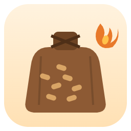

# Suivi Stock Pellet

<table>
<tr>
<td>

[](https://github.com/cyclope205/suivi-stock-pellet/releases)
[](https://github.com/cyclope205/suivi-stock-pellet/actions/workflows/validate.yml)
[](LICENSE)
[](https://github.com/hacs/integration)

</td>
<td width="110" align="right">

</td>
</tr>
</table>

[](https://buymeacoffee.com/cyclope205)
[](https://paypal.me/cyclope205)

Intégration Home Assistant pour suivre le stock, la consommation et les achats de granulés de bois (pellets), avec une carte Lovelace clé en main.

## Captures d'écran

<!--
Remplace les liens ci-dessous par tes propres captures : dépose les images
dans docs/screenshots/ (même noms de fichiers) et elles s'afficheront ici.
-->

| Vue d'ensemble | Sélecteur de saison |
|---|---|
|  |  |

| Graphique quantité / coût | Configurateur de carte |
|---|---|
|  |  |

## Fonctionnalités

- Suivi du stock en temps réel (kg et sacs), calculé à partir d'un journal d'achats/consommations — jamais de compteur qui dérive.
- Capteur d'énergie consommée en kWh (`device_class: energy`, `state_class: total_increasing`) compatible avec le tableau de bord Énergie de Home Assistant, comme source "Gaz/Autre".
- Suivi des dépenses (€) et du nombre de jours d'utilisation, par saison de chauffe.
- Saisons calculées automatiquement à partir d'un mois de départ configurable (pas d'années codées en dur à ajouter chaque année).
- Historique conservé indéfiniment : aucune saison n'est jamais supprimée ou écrasée au changement de saison, chaque saison passée reste consultable (tuiles, historique, graphiques) via le sélecteur de saison.
- Sélecteur de saison dans l'en-tête de la carte : consulte les tuiles, l'historique et le graphique mensuel de n'importe quelle saison passée (les saisies restent verrouillées sur la saison en cours).
- Graphique "Évolution de la consommation" avec deux courbes superposables (sacs consommés / coût en €) et des boutons pour n'afficher que l'une des deux.
- Graphique "Prix moyen du sac par saison" pour suivre l'évolution du coût des granulés d'une saison à l'autre.
- Configurateur visuel (éditeur de carte intégré) pour activer/désactiver chaque section de la carte sans toucher au YAML.
- Carte Lovelace intégrée (`custom:suivi-stock-pellet-card`) : stock en un coup d'œil, boutons "+ Consommation" / "+ Achat", annulation de la dernière saisie, historique des dernières entrées. Aucune ressource à ajouter manuellement, la carte est servie par l'intégration.

## Installation

### Via HACS (dépôt personnalisé)

1. Ajouter ce dépôt à HACS :

   [](https://my.home-assistant.io/redirect/hacs_repository/?owner=cyclope205&repository=suivi-stock-pellet&category=integration)

2. Installer **Suivi Stock Pellet**, puis redémarrer Home Assistant.
3. **Paramètres → Appareils et services → Ajouter une intégration** → rechercher "Suivi Stock Pellet".

### Configuration

À l'ajout de l'intégration :

| Paramètre | Description | Défaut |
|---|---|---|
| Poids d'un sac | Poids d'un sac de granulés (kg) | 15 |
| Prix moyen d'un sac | Utilisé comme référence (le prix réel peut être saisi à chaque achat) | 6.5 € |
| Pouvoir calorifique | kWh par kg de granulés, pour le calcul énergie | 4.8 |
| Mois de début de saison | Mois à partir duquel une nouvelle saison de chauffe commence | 9 (septembre) |

Ces valeurs sont modifiables ensuite via **Configurer** sur l'intégration.

## Utilisation

Ajoute la carte à un tableau de bord :

```yaml
type: custom:suivi-stock-pellet-card
```

Options de configuration de la carte (toutes optionnelles, tout est affiché par défaut — modifiables aussi via le configurateur visuel) :

| Option | Description |
|---|---|
| `show_stats` | Tuiles consommé / énergie / dépensé / jours |
| `show_cost_stats` | Tuiles coût / jour, coût / mois, coût du sac |
| `show_actions` | Boutons et formulaires de saisie |
| `show_monthly_chart` | Graphique "Évolution de la consommation" (quantité / coût) |
| `show_price_chart` | Graphique "Prix moyen du sac par saison" |
| `show_history` | Liste des dernières saisies |

Ou utilise directement les services :

- `suivi_stock_pellet.log_consumption` (`qty_bags`, `date` facultative)
- `suivi_stock_pellet.log_purchase` (`qty_bags`, `price_eur` facultatif, `date` facultative)
- `suivi_stock_pellet.undo_last_entry`

## Entités créées

- `sensor.*_stock` — stock actuel (kg), avec le nombre de sacs et la saison en attributs
- `sensor.*_consomme_kg` — consommé cette saison (kg)
- `sensor.*_consomme_kwh` — énergie consommée cette saison (kWh, tableau de bord Énergie)
- `sensor.*_achete_kg` — acheté cette saison (kg)
- `sensor.*_depense` — dépensé cette saison (€)
- `sensor.*_jours_utilisation` — nombre de jours de consommation enregistrés

## Licence

MIT — voir [LICENSE](LICENSE).

---

### ☕ Cette intégration te fait gagner du temps ?

Un petit don est toujours apprécié : ça m'aide à maintenir le projet et à ajouter de nouvelles fonctionnalités.

<a href="https://buymeacoffee.com/cyclope205"></a>
<a href="https://paypal.me/cyclope205"></a>

</div>
