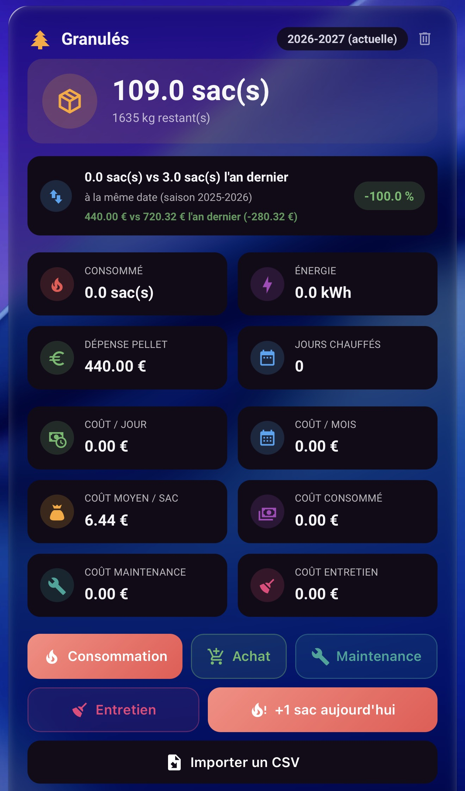
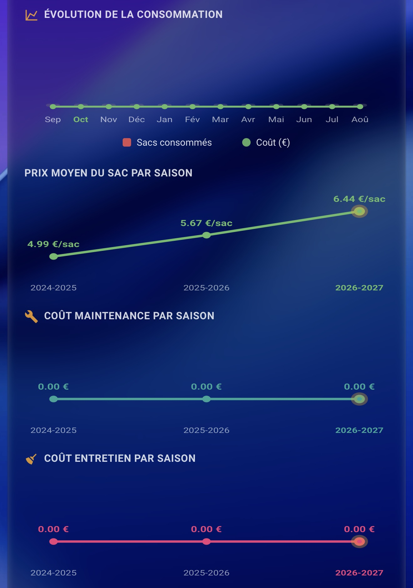

# Suivi Stock Pellet


[](https://github.com/cyclope205/suivi-stock-pellet/releases)
[](https://github.com/cyclope205/suivi-stock-pellet/actions/workflows/validate.yml)
[](https://github.com/cyclope205/suivi-stock-pellet/actions/workflows/tests.yml)
[](LICENSE)
[](https://github.com/hacs/integration)

---

### ☕ Merci aux donateurs

<!--START_SECTION:paypal-->

<!--END_SECTION:paypal-->

<!--START_SECTION:buy-me-a-coffee-->
<!-- Les nouveaux dons seront ajoutés ici automatiquement -->
<!--END_SECTION:buy-me-a-coffee-->

### ❤️ Sponsors GitHub

<!--START_SECTION:github-sponsors-->
<!-- Aucun sponsor GitHub public actif pour le moment -->
<!--END_SECTION:github-sponsors-->

---

[](https://bmc-eight-red.vercel.app/api/donate?repo=suivi-stock-pellet) [](https://bmc-eight-red.vercel.app/api/paypal?repo=suivi-stock-pellet&amount=5)


Intégration Home Assistant pour suivre le stock, la consommation et les achats de granulés de bois (pellets), avec une carte Lovelace clé en main.

## Captures d'écran

---

Configuration de l'intégration — **Sacs** :


---

Configuration de l'intégration — **Kilogrammes (kg)** :


---

Import d'une ancienne saison par **CSV** :


---

Vue d'ensemble:


---

Sélecteur de saison:


---

Graphique quantité:


---

Configurateur de carte:


---

Calendrier des ajouts:


---

Vue d'ensemble de la carte v1.10.0 — suppression de saison, coûts maintenance/entretien :



---

Graphiques coût maintenance / entretien par saison :




## Fonctionnalités

- Suivi du stock en temps réel (kg et sacs), calculé à partir d'un journal d'achats/consommations — jamais de compteur qui dérive.
- L'unité d'affichage est choisie dans la **configuration de l'intégration** : **Sacs** (quantités et prix en sacs et €/sac) ou **Kilogrammes (kg)** (quantités et prix en kg et €/kg). Le choix est propre à chaque intégration et n'impacte pas une autre intégration existante. Le poids de référence de **15 kg par sac reste fixe en interne** et n'est pas demandé à l'utilisateur.
- Le prix demandé dans la configuration dépend de l'unité choisie : **Prix moyen d'un sac (€)** en mode Sacs ou **Prix moyen au kg (€)** en mode kg. Le graphique de prix moyen par saison utilise la même unité, avec titre, valeurs et symbole €/sac ou €/kg synchronisés.
- Capteur d'énergie consommée en kWh (`device_class: energy`, `state_class: total` avec réinitialisation au début de chaque saison) compatible avec le tableau de bord Énergie de Home Assistant, comme source "Gaz/Autre".
- Suivi des dépenses (€) et du nombre de jours d'utilisation, par saison de chauffe, avec tuiles de coût dérivées (coût / jour, coût / mois, coût du sac).
- Saisons calculées automatiquement à partir d'un mois de départ configurable (pas d'années codées en dur à ajouter chaque année).
- Le **mois de début de saison** est configuré dans l'intégration ; la fin de saison est automatiquement le mois précédent. Par exemple, avec septembre comme début, **septembre 2025 → août 2026 = saison 2025-2026**, et un achat de juillet 2026 appartient à cette saison.
- Historique conservé indéfiniment : aucune saison n'est jamais supprimée ou écrasée au changement de saison, chaque saison passée reste consultable (tuiles, historique, graphiques) via le sélecteur de saison.
- Sélecteur de saison dans l'en-tête de la carte : consulte les tuiles, l'historique et le graphique mensuel de n'importe quelle saison passée (les saisies restent verrouillées sur la saison en cours).
- Les dates des saisies (Achat/Consommation) ne sont pas limitées à aujourd'hui : on peut saisir une date passée (ou future) librement, l'entrée est alors rattachée à la saison correspondant à cette date. Ça permet de reconstruire une saison passée entièrement (achats et consommations historiques) même après coup, sans dépendre du sélecteur de saison (qui ne sert qu'à consulter, pas à saisir).
- Les anciennes saisons peuvent aussi être **reconstituées par import CSV** : le bouton **« Importer un CSV »** réservé aux administrateurs analyse d'abord le fichier et affiche un aperçu avant confirmation. La saison `AAAA-AAAA`, les colonnes mensuelles de consommation et les achats (date, quantité, prix) sont détectés automatiquement ; les nombres français et les montants en euros sont pris en charge. La saison explicitement indiquée dans le fichier est conservée pour les données importées. Plusieurs anciennes saisons peuvent être importées séparément. Les données restent stockées en sacs et peuvent ensuite être affichées en Sacs ou en kg selon la configuration, avec la référence interne fixe de 15 kg par sac. Les CSV vides ou invalides sont refusés avec une erreur explicite.
- Comparaison à date égale avec la saison précédente : affiche la consommation de la saison sélectionnée (via le sélecteur de saison, saison en cours par défaut) face à celle de la saison précédente au même nombre de jours écoulés depuis le début de saison, avec un badge en pourcentage, ainsi que le coût en € des deux saisons et leur différence en € (masquable via `show_comparison`).
- Les saisons sans aucune saisie sont automatiquement supprimées de la liste (au démarrage et dès qu'une saison redevient vide) : pas besoin de nettoyer manuellement une saison créée par erreur ou vidée par une correction.
- Le sélecteur de saison reste toujours cohérent avec la saison consultée, même pour une saison qui n'a encore aucune saisie (saison passée pas encore renseignée, ou saisie qui vient d'échouer) : il n'affiche plus par erreur la saison en cours à sa place.
- Modifier ou supprimer une saisie ne peut jamais faire passer le stock réel d'une saison sous 0 (plus consommé qu'acheté) : ce cas est refusé avec un message d'erreur explicite plutôt que d'être accepté silencieusement.
- Les tuiles `sensor.*` (stock, consommé, dépensé...) ignorent les saisies dont la date est dans le futur tant que cette date n'est pas atteinte, pour rester un vrai instantané du stock disponible aujourd'hui.
- Le mois de début de saison ne peut plus être changé une fois que le journal contient des saisies (pour éviter de désynchroniser les saisons déjà enregistrées de la nouvelle règle).
- Les tuiles/l'historique/le graphique de la carte restent visibles pour tous les utilisateurs du tableau de bord, pas seulement les administrateurs (seules les actions d'écriture - saisie, modification, suppression - restent réservées à un accès normal).
- Un échec d'enregistrement (stock insuffisant, saison invalide...) affiche maintenant un message d'erreur au lieu de fermer silencieusement le formulaire comme si tout s'était bien passé.
- Graphique "Évolution de la consommation" avec deux courbes superposables (sacs consommés / coût en €) et des boutons pour n'afficher que l'une des deux. Quand une seule des deux courbes est affichée, sa valeur mensuelle (sacs ou €) apparaît directement sur le graphique en plus du survol/tap habituel.
- Graphique "Prix moyen du sac par saison" pour suivre l'évolution du coût des granulés d'une saison à l'autre.
- Configurateur visuel (éditeur de carte intégré) pour activer/désactiver chaque section de la carte sans toucher au YAML.
- Stock initial d'une saison automatiquement repris du stock restant de la saison précédente (dès la première saisie dans la nouvelle saison) ; corrigeable manuellement via le service `set_stock_initial` (comptage physique, saison déjà entamée avant l'ajout de cette fonctionnalité...).
- Carte Lovelace intégrée (`custom:suivi-stock-pellet-card`) : stock en un coup d'œil, boutons "+ Consommation" / "+ Achat" et bouton rapide "+1 sac aujourd'hui" (visible uniquement sur la saison en cours), annulation de la dernière saisie, historique des dernières entrées avec modification (crayon) et suppression (corbeille, avec confirmation) de chaque saisie. Aucune ressource à ajouter manuellement, la carte est servie par l'intégration.
- Section calendrier en bas de la carte (navigable mois par mois), activable via l'option show_calendar. Chaque jour affiche les achats et consommations enregistrés ce jour-la, avec une couleur differente selon le type. Le calendrier se met a jour immédiatement apres un ajout, une suppression ou une modification de date d'une saisie, sans attendre un rafraichissement differe - y compris pour le bouton rapide "+1 sac aujourd'hui".
- Suppression d'une saison entière via le bouton poubelle à côté du sélecteur de saison dans l'en-tête de la carte, avec confirmation. Un avertissement s'affiche si une saison suivante existe déjà, car son report de stock (stock initial repris de la saison supprimée) n'est pas recalculé automatiquement.
- Suivi des frais de maintenance et d'entretien du poêle, indépendamment du stock de granulés : deux boutons dédiés ("Maintenance" / "Entretien") ouvrent chacun un formulaire (coût, date, note libre) utilisable même sur une saison passée via le champ saison. Ces saisies apparaissent dans l'historique avec leur note, dans le calendrier avec une couleur dédiée par type, et alimentent deux tuiles ("Coût maintenance", "Coût entretien") ainsi que deux courbes "par saison" masquables.
- La tuile "Dépensé" a été renommée "Dépense pellet" pour la distinguer des nouveaux coûts de maintenance et d'entretien, qui ne sont pas comptés dans le prix moyen du sac.

## Installation

### Via HACS (dépôt personnalisé)

1. Ajouter ce dépôt à HACS :

[](https://my.home-assistant.io/redirect/hacs_repository/?owner=cyclope205&repository=suivi-stock-pellet&category=integration)

2. Installer **Suivi Stock Pellet**, puis redémarrer Home Assistant.
3. **Paramètres → Appareils et services → Ajouter une intégration** → rechercher "Suivi Stock Pellet".

**⚠️ La carte affiche « Erreur de configuration : Custom element doesn't exist: suivi-stock-pellet-card » juste après l'installation ?** C'est normal, le temps que le navigateur recharge le cache : faites **Ctrl+F5** sur navigateur (rechargement forcé), ou **fermez complètement puis relancez l'application Home Assistant Companion** sur mobile. La carte s'affiche ensuite normalement.

### Configuration

À l'ajout de l'intégration :

| Paramètre | Description | Défaut |
|---|---|---|
| Unité d'affichage | Affichage des quantités et des prix en sacs ou en kilogrammes | Sacs |
| Prix moyen d'un sac (€) | Affiché et utilisé lorsque l'unité **Sacs** est sélectionnée | 6,50 € |
| Prix moyen au kg (€) | Affiché et utilisé lorsque l'unité **Kilogrammes (kg)** est sélectionnée | 0,43 € |
| Pouvoir calorifique | kWh par kg de granulés, pour le calcul énergie | 4,8 |
| Mois de début de saison | Mois à partir duquel une nouvelle saison de chauffe commence. La fin de saison est automatiquement le mois précédent | 9 (septembre) |

> Le poids de référence de **15 kg par sac est fixe en interne** et n'est pas demandé dans la configuration.

Ces valeurs sont modifiables ensuite via **Configurer** sur l'intégration. Le champ de prix proposé dépend de l'unité d'affichage choisie.

## Utilisation

Ajoute la carte à un tableau de bord :

```yaml
type: custom:suivi-stock-pellet-card
```

Options de configuration de la carte (toutes optionnelles, tout est affiché par défaut — modifiables aussi via le configurateur visuel) :

| Option | Description |
|---|---|
| `show_stats` | Tuiles consommé / énergie / dépensé / jours |
| `show_cost_stats` | Tuiles coût / jour, coût / mois, coût du sac, coût saison |
| `show_actions` | Boutons et formulaires de saisie |
| `show_monthly_chart` | Graphique "Évolution de la consommation" (quantité / coût) |
| `show_price_chart` | Graphique "Prix moyen du sac par saison" |
| `show_maintenance_chart` | Graphique "Coût maintenance par saison" |
| `show_entretien_chart` | Graphique "Coût entretien par saison" |
| `show_history` | Liste des dernières saisies |
| `show_comparison` | Comparaison avec la saison précédente à date égale |

Les formulaires Achat/Consommation de la carte acceptent une date libre (passée ou future), ce qui permet de reconstruire une saison passée entièrement après coup ; ils incluent aussi un champ "Saison" optionnel (AAAA-AAAA) pour rattacher la saisie à une saison différente de celle déduite de la date (ex. un achat fait en avance pour la saison suivante), et le formulaire Achat propose un champ "prix total du bon de livraison" en alternative au prix par sac.

Ou utilise directement les services :

- `suivi_stock_pellet.log_consumption` (`qty_bags`, `season` facultative, `date` facultative)
- `suivi_stock_pellet.log_purchase` (`qty_bags`, `season` facultative, `price_eur` facultatif — utilise le prix moyen actuel si absent, `date` facultative)
- `suivi_stock_pellet.undo_last_entry`
- `suivi_stock_pellet.edit_entry` (`season`, `index`, champs à modifier)
- `suivi_stock_pellet.delete_entry` (`season`, `index`)
- `suivi_stock_pellet.set_stock_initial` (`season`, `stock_initial_bags`) — définit ou corrige le stock de départ d'une saison
- `suivi_stock_pellet.delete_season` (`season`) — supprime entièrement une saison (toutes ses saisies)
- `suivi_stock_pellet.log_maintenance` (`price_eur`, `season` facultative, `date` facultative, `note` facultative) — enregistre un coût de maintenance
- `suivi_stock_pellet.log_entretien` (`price_eur`, `season` facultative, `date` facultative, `note` facultative) — enregistre un coût d'entretien

## Entités créées

- `sensor.*_stock` — stock actuel (kg), avec le nombre de sacs et la saison en attributs
- `sensor.*_consomme_kg` — consommé cette saison (kg)
- `sensor.*_consomme_kwh` — énergie consommée cette saison (kWh, tableau de bord Énergie)
- `sensor.*_achete_kg` — acheté cette saison (kg)
- `sensor.*_depense` — dépensé cette saison (€)
- `sensor.*_jours_utilisation` — nombre de jours de consommation enregistrés

## Service `set_stock_initial`

Pour corriger manuellement le stock de depart d'une saison (comptage physique, saison deja entamee avant l'ajout du report automatique...), en plus du report automatique decrit ci-dessus :

| Parametre | Description |
|---|---|
| `season` | Saison a corriger, au format AAAA-AAAA (ex. 2024-2025). |
| `stock_initial_bags` | Nombre de sacs presents au debut de la saison, avant tout achat ou consommation enregistre dans cette saison. |

```yaml
action: suivi_stock_pellet.set_stock_initial
data:
  season: "2024-2025"
  stock_initial_bags: 12
```

## Licence

MIT — voir [LICENSE](LICENSE).
